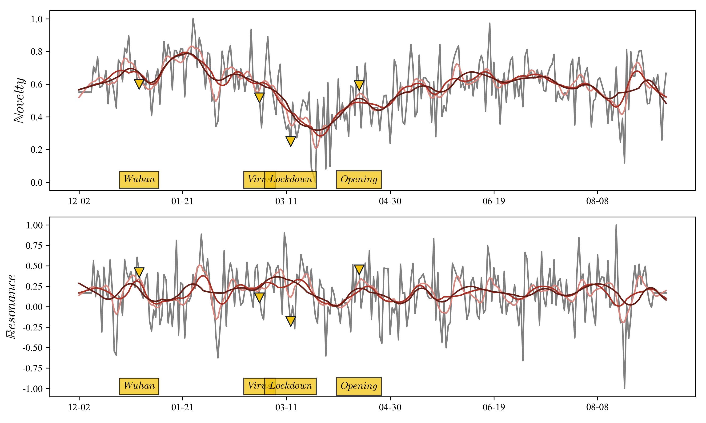
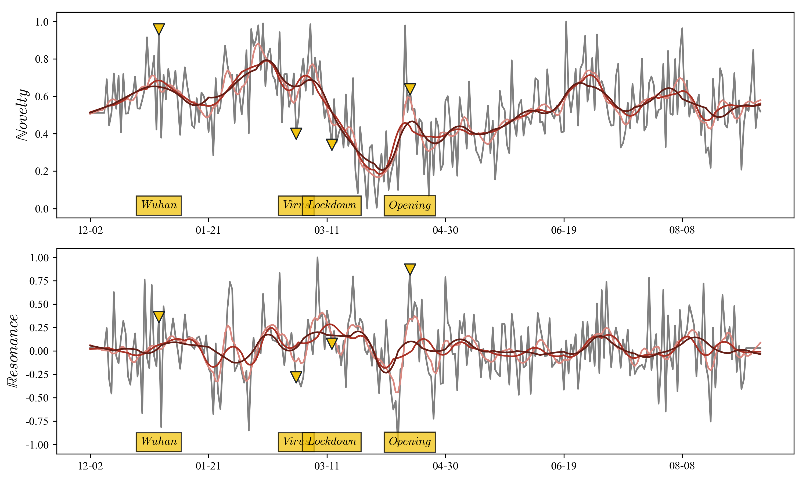
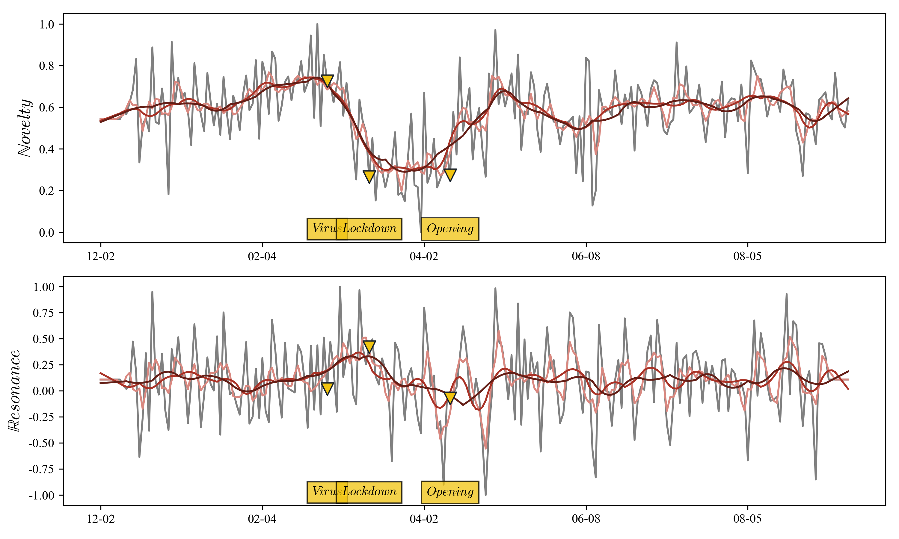
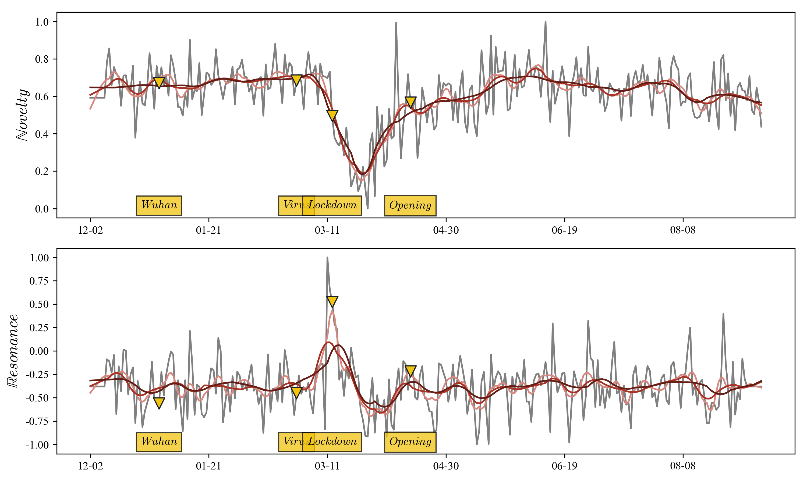
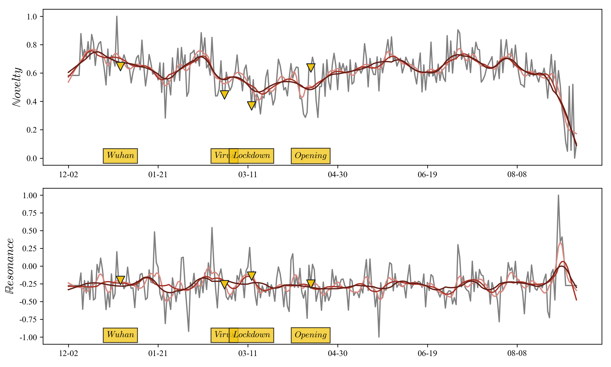
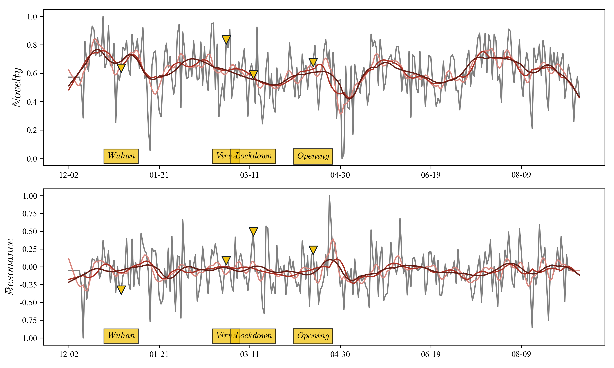

# HOPEful Weeks in CHCAA #

## Week 39 Summary ##

### New Information Decoupling ###

We ran the pipeline on more newspapers and updated to recent news:

	
	<em>Berlingske, previously known as Berlingske Tidende, is a Danish national daily newspaper based in Copenhagen.</em>

	
	<em>Morgenavisen Jyllands-Posten, commonly shortened to Jyllands-Posten or JP, is a Danish daily broadsheet newspaper.</em>

	
	<em>Kristeligt Dagblad is a Danish newspaper in Copenhagen, Denmark.</em>

	
	<em>Politiken is a leading Danish daily broadsheet newspaper, published by JP/Politikens Hus in Copenhagen, Denmark.</em>

	
	<em>B.T. is a Danish tabloid newspaper which offers general news about various subjects such as sports, politics and current affairs.</em>

	
	<em>Ekstra Bladet is a Danish tabloid newspaper, published by JP/Politikens Hus in Copenhagen.</em>

