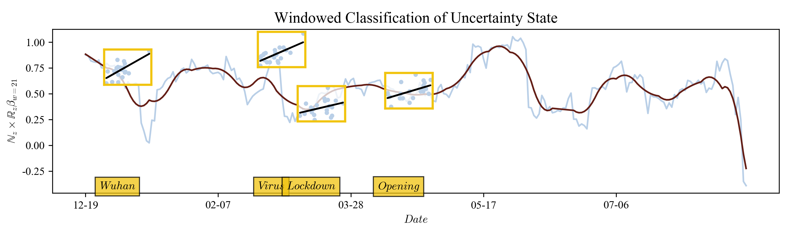
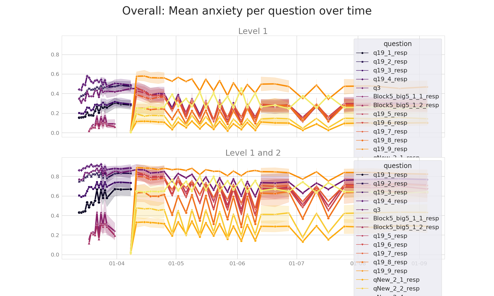

# HOPEful Weeks in CHCAA #

## Week 39 Summary ##

### News Information Decoupling ###

We ran the pipeline on more newspapers and updated to recent news:

	
	<em>Berlingske, previously known as Berlingske Tidende, is a Danish national daily newspaper based in Copenhagen.</em>

	
	<em>Morgenavisen Jyllands-Posten, commonly shortened to Jyllands-Posten or JP, is a Danish daily broadsheet newspaper.</em>

	
	<em>Kristeligt Dagblad is a Danish newspaper in Copenhagen, Denmark.</em>

	
	<em>Politiken is a leading Danish daily broadsheet newspaper, published by JP/Politikens Hus in Copenhagen, Denmark.</em>

	
	<em>B.T. is a Danish tabloid newspaper which offers general news about various subjects such as sports, politics and current affairs.</em>

	
	<em>Ekstra Bladet is a Danish tabloid newspaper, published by JP/Politikens Hus in Copenhagen.</em>

## Week 40 Summary ##

### Sentiment analysis of front pages ###

Looked at the sentiment of front page articles in legacy media.  
Sentiment scores are acquired using VADER.

	
	<em>Berlingske, previously known as Berlingske Tidende, is a Danish national daily newspaper based in Copenhagen.</em>

	
	<em>Morgenavisen Jyllands-Posten, commonly shortened to Jyllands-Posten or JP, is a Danish daily broadsheet newspaper.</em>

	
	<em>Kristeligt Dagblad is a Danish newspaper in Copenhagen, Denmark.</em>

	
	<em>Politiken is a leading Danish daily broadsheet newspaper, published by JP/Politikens Hus in Copenhagen, Denmark.</em>

	
	<em>B.T. is a Danish tabloid newspaper which offers general news about various subjects such as sports, politics and current affairs.</em>

	
	<em>Ekstra Bladet is a Danish tabloid newspaper, published by JP/Politikens Hus in Copenhagen.</em>

	
	<em>Front page sentiment of Politiken.</em>

	
	<em>Front page LDA topic models.</em>

## Week 41-42 Summary ##

### Persistence of Affective States ###

	
	
	
	<em>Berlingske, previously known as Berlingske Tidende, is a Danish national daily newspaper based in Copenhagen.</em>

	
	
	
	<em>Morgenavisen Jyllands-Posten, commonly shortened to Jyllands-Posten or JP, is a Danish daily broadsheet newspaper.</em>

	
	
	
	<em>Kristeligt Dagblad is a Danish newspaper in Copenhagen, Denmark.</em>

	
	
	
	<em>Politiken is a leading Danish daily broadsheet newspaper, published by JP/Politikens Hus in Copenhagen, Denmark.</em>

	
	
	
	<em>B.T. is a Danish tabloid newspaper which offers general news about various subjects such as sports, politics and current affairs.</em>

	
	
	
	<em>Ekstra Bladet is a Danish tabloid newspaper, published by JP/Politikens Hus in Copenhagen.</em>

### NxR fixed window coefficients ###

	
	<em>Berlingske, previously known as Berlingske Tidende, is a Danish national daily newspaper based in Copenhagen.</em>

	
	<em>Morgenavisen Jyllands-Posten, commonly shortened to Jyllands-Posten or JP, is a Danish daily broadsheet newspaper.</em>

	
	<em>Kristeligt Dagblad is a Danish newspaper in Copenhagen, Denmark.</em>

	
	<em>Politiken is a leading Danish daily broadsheet newspaper, published by JP/Politikens Hus in Copenhagen, Denmark.</em>

	
	<em>B.T. is a Danish tabloid newspaper which offers general news about various subjects such as sports, politics and current affairs.</em>

	
	<em>Ekstra Bladet is a Danish tabloid newspaper, published by JP/Politikens Hus in Copenhagen.</em>

## decoupling experiments ##

	
	<em>dynamic time warping (DTW) is a set of algorithms for calculating the optimal match between two time series</em>

## Anxiety survey preliminary results ##
A survey about different measures related to people's feelings of anxiety were measured during the lockdown in Denmark. The responses to 15 questions are included in the analysis, from people from 8 countries residing within Denmark.

	
	<em>Data was collected with time intervals and at varying quantities</em>

	
	<em>Self reported anxiety on average per each question</em>

	
	<em>Higher fear in Level 1 and Level 2 groups</em>

	
	<em>Higher fear in Level 1 and Level 2 groups, more distinct country-based differences in Level 1 and Level 2, seems to be a downward trend</em>

	
	<em>Least concern for self, then close friends, family, and most concern for social unrest</em>

	
	<em>Most concerned for economy, rest don't distinguish much</em>

	
	<em>Social unrest was the only question that was asked both in the start and throughout the lockdown. Either the concern for social unrest went down a lot after the first round of questionnaires, or in the context of other questions being asked - social unrest was less of a concern (compared to exonomy)</em>

## COMMENTS ##
RITUAL OF OBJECTIVITY vs. RITUAL OF EMOTIONALITY from journalism studies
This is based on an abstract. But the full papers this refers to are https://researchportal.helsinki.fi/files/143104559/journalism_2020.pdf and https://researchportal.helsinki.fi/files/132723715/An_Approach_for_Agile_Interdisciplinary_Digital_Humanities_Research_a_Case_Study_in_Journalism.pdf (not exactly the same but includes a lot of the content) 
